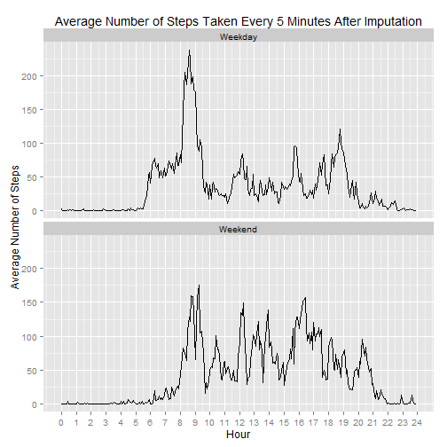

## Assignment background

Devices marketed by vendors such as Nike and others are able to collect personal
activity data such as the number of steps taken each day.  The dataset for this assignment
is the record of walking activity collected from an anonymous user of one of these
devices.  It contains the number of steps taken during each 5 minute period in the 
months of October and November, 2012.

The assignment seeks to extract some basic features of the data such as the distribution
of daily step totals, the average number of steps taken during each 5-minute time period
within a day, and other features.

---

## Load packages

These packages are required to repeat the results of this analysis:


```r
library(dplyr)
library(ggplot2)
library(knitr)  # For simple html tables.
```

---

## Define helper functions

The raw data describing the 5 minute time interval is actually a concatenation of hours
and minutes represented as an integer.  The functions defined here are used to transform
the raw `interval` variable into forms that are more approriate for this analysis. 


```r
# Convert raw interval variable into decimal hours.
to.hour <- function(interval){
    interval.char <- sprintf("%04d", interval)
    as.numeric(substr(interval.char, 1, 2)) + as.integer(substr(interval.char, 3, 4)) / 60.0
}

# Convert raw interval variable into character hh:mm display.
to.hhmm <- function(interval){
    interval.char <- sprintf("%04d", interval)
    paste0(substr(interval.char, 1, 2), ":", substr(interval.char, 3, 4))
}
```

---

## Read raw data

The data for this assignment can be found [here](https://d396qusza40orc.cloudfront.net/repdata%2Fdata%2Factivity.zip).
It was downloaded and unzipped into the current working directory. The structure of the
raw dataset appears below.  For `interval` the big jump in values bewteen `55` and `100` is a clue 
that there is a problem with this variable.


```r
rawData <- read.csv("activity/activity.csv", header = TRUE, sep = ",", 
                    col.names = c("steps", "date", "interval"),
                    colClasses = c("integer", "Date", "integer")) %>% tbl_df %>% 
            mutate(weekday = weekdays(date), hour = to.hour(interval), hhmm = to.hhmm(interval))
glimpse(rawData)
```

```
## Observations: 17,568
## Variables: 6
## $ steps    (int) NA, NA, NA, NA, NA, NA, NA, NA, NA, NA, NA, NA, NA, N...
## $ date     (date) 2012-10-01, 2012-10-01, 2012-10-01, 2012-10-01, 2012...
## $ interval (int) 0, 5, 10, 15, 20, 25, 30, 35, 40, 45, 50, 55, 100, 10...
## $ weekday  (chr) "Monday", "Monday", "Monday", "Monday", "Monday", "Mo...
## $ hour     (dbl) 0.00000000, 0.08333333, 0.16666667, 0.25000000, 0.333...
## $ hhmm     (chr) "00:00", "00:05", "00:10", "00:15", "00:20", "00:25",...
```

---

## Mean steps per day

What is the mean total number of steps taken per day?

Group the raw data by day, and compute the sum across all time periods of the number of steps 
taken each day.  Ignore for now any periods where the data are missing.  Generate a histogram 
of daily step totals to see their distribution.


```r
stepsPerDay <- rawData %>% 
    group_by(date) %>% summarise(totalSteps = sum(steps, na.rm = TRUE))

ggplot(stepsPerDay) +
    geom_histogram(aes(x = totalSteps), 
                   binwidth = 1000, colour = "black", fill = "gray") +
    xlab("Steps per Day") + ylab("Number of Days") +
    scale_y_continuous(breaks = seq(0, 10, 1)) +
    ggtitle("Histogram of Steps per Day")
```

 

Daily step totals are concetrated between 10,000 and 15,000 but there is a tall bar on 
the far left of the histogram.  This happens because there are 8 days with a  
step total equal to zero.  Missing values are driving this feature.

Compute the mean and median steps per day.


```r
statsPerDay <- data.frame("Statistic" = c("Mean", "Median"), 
                          "Value" = c(mean(stepsPerDay$totalSteps), 
                                      quantile(stepsPerDay$totalSteps, prob = 0.5)),
                          row.names = NULL)

# A knitr function for printing html tables.
kable(statsPerDay, digits = 1, align = c("l", "l"), 
      caption = "Steps per Day", format.args = list(decimal.mark = ".", big.mark = ","))
```


|Statistic |Value    |
|:---------|:--------|
|Mean      |9,354.2  |
|Median    |10,395.0 |

With Mean < Median and given the histogram we can see that the raw daily step totals 
are slightly skwewed to the left.

---

## Average daily activity

What is the average daily activity pattern?

Re-group the raw data by 5-minute time period and compute the average across all days   
of the number of steps taken in each period.  Ignore missing values and plot the average step
counts by time period.

**Note:** The `interval` variable is a concatenation of hours and minutes stored as an integer
and is not a proper representation of time. For plotting I chose to convert the original 
`interval` variable to an equivalent `hour` variable. There will be 12 data points plotted every hour.   


```r
stepsPerTimePeriod <- rawData %>%
    group_by(hour, hhmm) %>% summarize(meanSteps = mean(steps, na.rm = TRUE))

ggplot(stepsPerTimePeriod) +
    geom_line(aes(x = hour, y = meanSteps)) + scale_x_continuous(breaks = seq(0, 24, 1)) +
    xlab("Hour") + ylab("Average Number of Steps") + ggtitle("Average Number of Steps Taken Every 5 Minutes") 
```

 

With data at this level we can find the beginning of the 5-minute time period with the maximum 
average number of steps taken.


```r
maxTimePeriod <- stepsPerTimePeriod %>% ungroup %>% 
    arrange(desc(meanSteps)) %>% slice(1) %>% select(hhmm, meanSteps)
colnames(maxTimePeriod) <- c("Time of Day", "Average Number of Steps")
kable(maxTimePeriod, digits = c(0, 1), align = c("c", "c"),
      caption = "Most Active Time Period", format.args = list(decimal.mark = ".", big.mark = ","))
```


| Time of Day | Average Number of Steps |
|:-----------:|:-----------------------:|
|    08:35    |          206.2          |

---

## Imputing missing values

The number of 5-minute time periods with missing step counts is shown below.


```r
numberMissing <- sum(is.na(rawData$steps))
names(numberMissing) <- "Periods with missing step counts"
print(numberMissing)
```

```
## Periods with missing step counts 
##                             2304
```

My imputation scheme is to replace each missing value with the average number of steps
taken for the corresponding day of week and time of day combination.


```r
meanDayTime <- rawData %>% group_by(weekday, hour) %>%
                summarize(meanSteps = mean(steps, na.rm = TRUE)) 
impData <- rawData %>% inner_join(meanDayTime, by = c("weekday", "hour")) 
impData$steps[is.na(impData$steps)] <- impData$meanSteps[is.na(impData$steps)] 
```

Replace NAs step counts with imputed values.  Plot the distribution of daily step totals
using the impute-adjusted data.


```r
impStepsPerDay <- impData %>% 
    group_by(date) %>% summarise(totalSteps = sum(steps))

ggplot(impStepsPerDay) +
    geom_histogram(aes(x = totalSteps), 
                   binwidth = 1000, colour = "black", fill = "gray") +
    xlab("Steps per Day") + ylab("Number of Days") +
    scale_y_continuous(breaks = seq(0, 10, 1)) +
    ggtitle("Histogram of Steps per Day After Imputation")
```

 

After imputation the overall distibution of steps per day has shifted to the right with an
increased number of days with step counts above 10,000.  The number of days with less than 1,000 steps has been  
reduced from 10 to 2.

The mean and median steps per day after imputation are shown below.


```r
impStatsPerDay <- data.frame("Statistic" = c("Mean", "Median"), 
                          "Value" = c(mean(impStepsPerDay$totalSteps), 
                                      quantile(impStepsPerDay$totalSteps, prob = 0.5)),
                          row.names = NULL)

kable(impStatsPerDay, digits = 1, align = c("l", "l"), 
      caption = "Total Steps per Day", format.args = list(decimal.mark = ".", big.mark = ","))
```


|Statistic |Value    |
|:---------|:--------|
|Mean      |10,821.2 |
|Median    |11,015.0 |

These give further evidence that imputation has shifted the data to the right, 
with an increase in the mean by 1466.98 steps per day, and an increase in the median by 620 steps per day.

---

## Weekday vs. weekend activity patterns

Are there differences in activity patterns between weekdays and weekends?

Add a factor to the post-imputation data indicating whether or not a given date falls 
on a weekday or weekend.


```r
impData2 <- impData %>% 
    mutate(weekendInd = factor(weekdays(date) %in% c("Saturday", "Sunday"), 
                               labels = c("Weekday", "Weekend")))
```

Plot of the average number of steps taken per time period, faceted by this new factor to 
contrast the step patterns for weekdays and weekends.  


```r
stepsPerTimePeriod2 <- impData2 %>%
    group_by(weekendInd, hour, hhmm) %>% summarize(meanSteps = mean(steps, na.rm = TRUE))

ggplot(stepsPerTimePeriod2) +
    geom_line(aes(x = hour, y = meanSteps)) + scale_x_continuous(breaks = seq(0, 24, 1)) +
    facet_wrap(~weekendInd, ncol = 1) +
    xlab("Hour") + ylab("Average Number of Steps") +
    ggtitle("Average Number of Steps Taken Every 5 Minutes After Imputation")
```

 

We can see that step intensity is spread more uniformly throughout the day on weekends 
and is more concentrated in the early hours on weekdays. It also appears that more late-evening 
steps are taken on weekends compared to weekdays.

---

## Summary

Weekday and weekend step patterns vary with a more uniform pattern throughout the day on weekends
and more early steps taking place in the early hours of weekdays.  Walking intensity is concentrated
between 10K and 15K steps per day but is affected by the quality of the raw data.  An imputation
strategy to replace NAs in the raw data with average values results in a slight shift to the right of the
original dataset.
